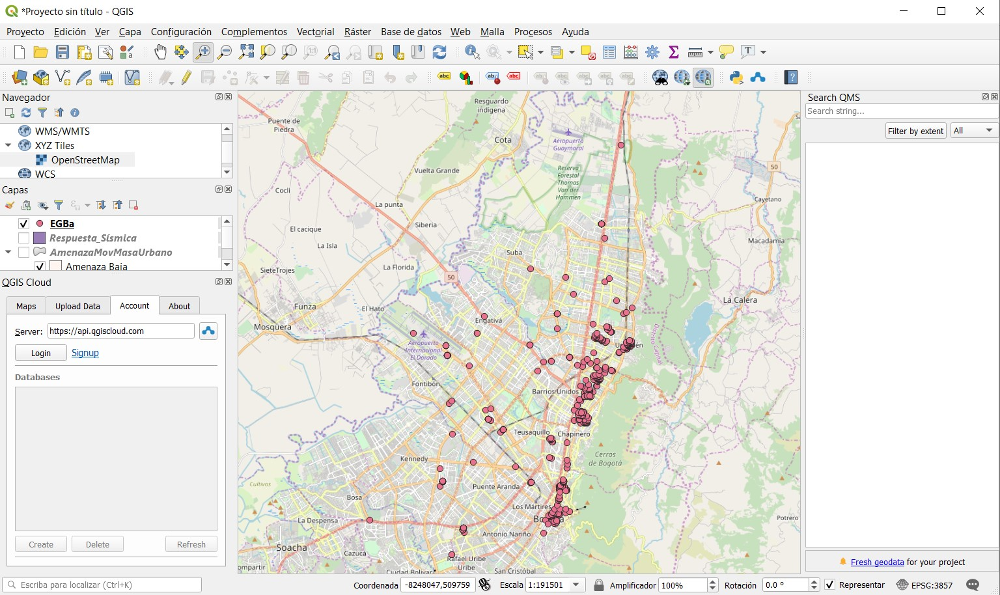
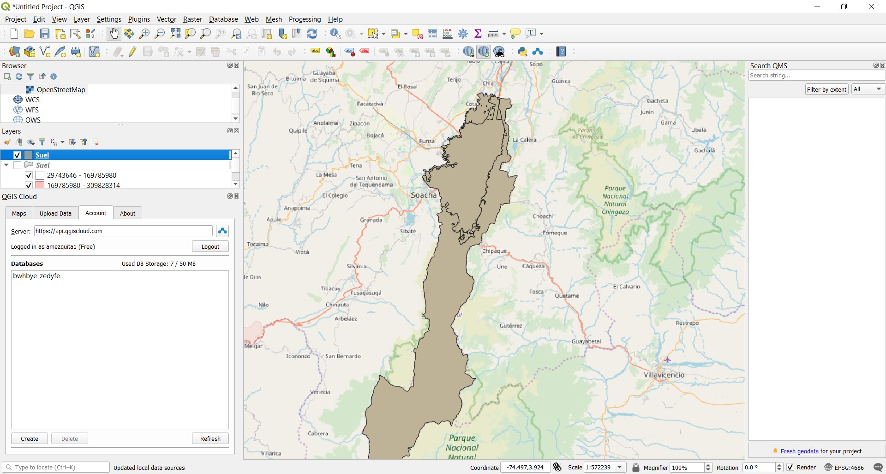
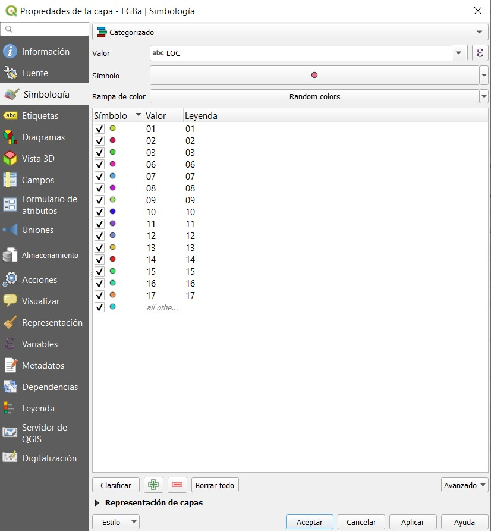
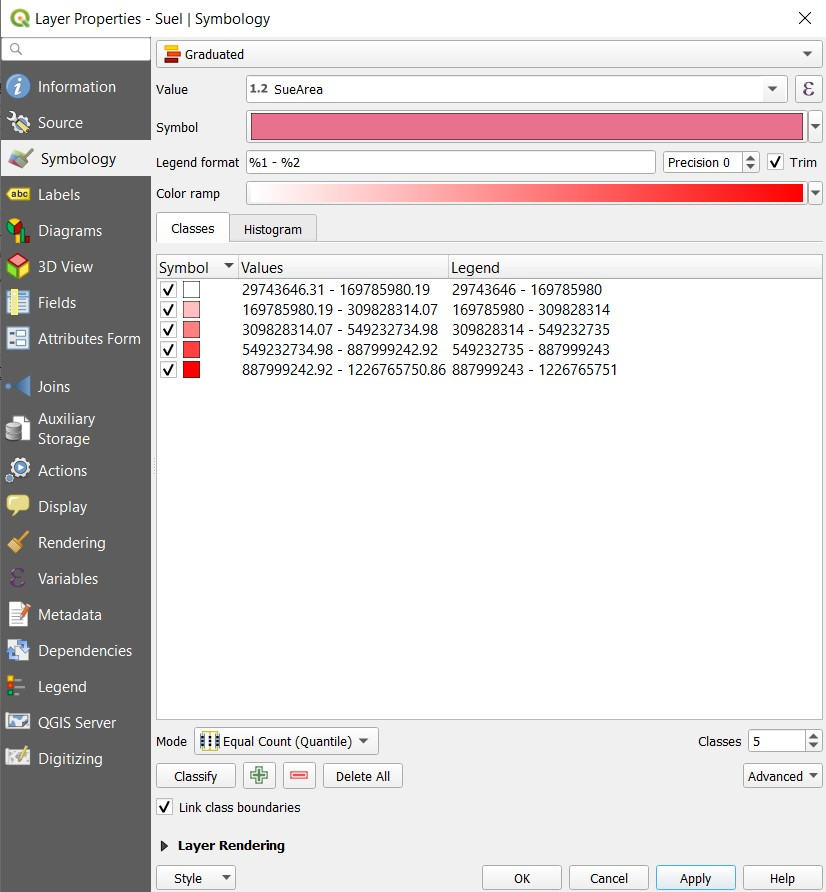
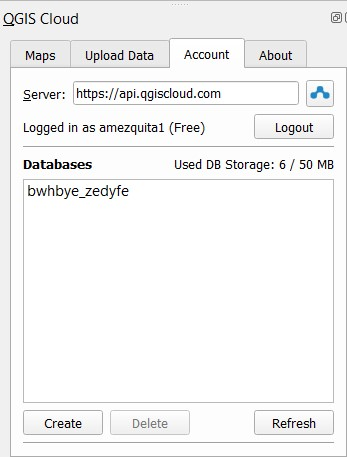
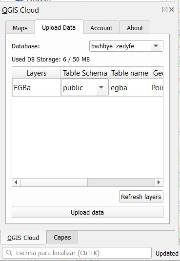
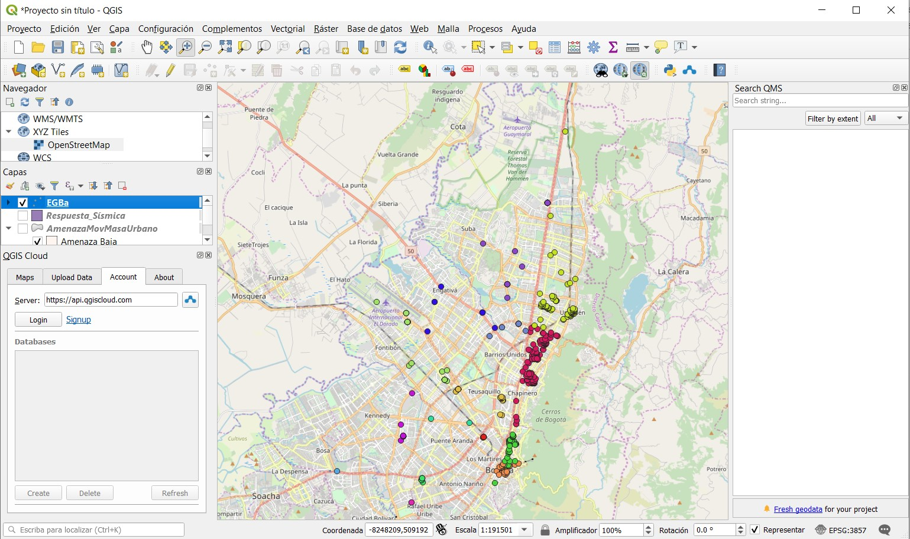
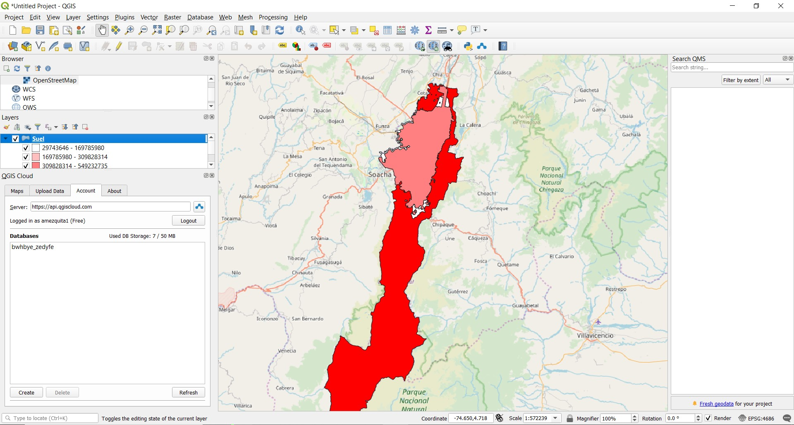

# TAREA 1
## Cuál es el problema a tratar?
Conocer los establecimientos de gastronomía y bar según la localidad. Además se quiere saber el área del suelo a partir del tipo al que corresponde
## Por qué un mapa ayuda a resolverlo?
Es una ayuda visual que permite identificar de mejor manera la ubicación de cada establecimiento, adicionalmente es útil para reconocer los tipos de suelo presentes en bogotá

## Descripción del mapa temático
El primer mapa muestra la ubicación por localidad de los establecimientos de gastronomía y bar localizados en la ciudad de Bogotá.
El segundo mapa muestra el tipo de suelo encontrado en todo el municipio de Bogotá el cual se clasifica a través de un rango de áreas.
## Descripción de los métodos de clasificación seleccionados
El primer método de clasificación seleccionado corresponde al método categorizado, el cual, para este caso, agrupa por colores todos los datos que corresponden a un mismo atributo, es decir, todos los puntos que se encuentren ubicados en la misma localidad, contaran con el mismo color.
El segundo método de clasificación corresponde a un rango de áreas en los que se encuentran los diferentes tipos de suelo

## Fuente de datos
Datos abiertos Bogotá http://datosabiertos.bogota.gov.co/
## Herramientas
-	QGis
-	Qgiscloud

## Proceso Realizado

1.	Inicialmente es necesario crear una cuenta en QGIS Cloud, posteriormente se debe intalar el plugin

 
2.	Descargar y subir la información al software QGIS
 
 
 

3.	Para categorizar el mapa se ingresó a propiedades y se eligió el tipo Categorizado para el valor LOC, Para la segunda forma de categorización se eligió agrupación de puntos tomando como base 200 unidades del mapa
 
 
 

4.	Para el desarrollo del mapa se utilizó el mapa base proporcionado por el software

 
5.	Una vez creados los mapas requeridos, se procede a publicarlos en la web, para ello es necesario ingresar a QGIS Cloud

 
En donde será necesario cargar las capas que se requieren publicar

 
 
Los mapas publicados son los siguientes

 

 
 
MAPA 1
https://qgiscloud.com/amezquita1/mapaweb2/?bl=&st=&l=OpenStreetMap%2CEGBa&t=mapaweb2&e=-8291992%2C505314%2C-8210712%2C540980

WMS: https://wms.qgiscloud.com/amezquita1/mapaweb2/

MAPA 2
https://qgiscloud.com/amezquita1/mapaweb21/?bl=&st=&l=OpenStreetMap%2CSuel&t=mapaweb21&e=-0.00018%2C-0.00009%2C0.00018%2C0.00009

WMS: https://wms.qgiscloud.com/amezquita1/mapaweb21/

