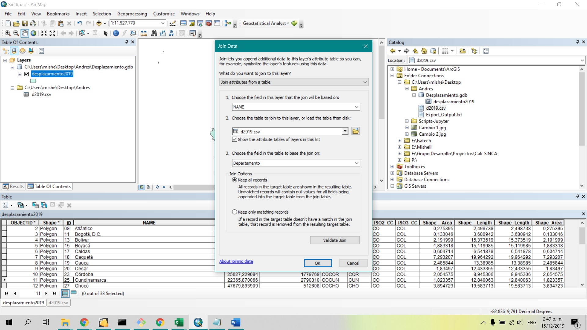

## Cuál es el problema a tratar?
Mediante la creación del mapa interactivo se busca explicar el comportamiento del desplazamiento forzado en Colombia, a través de estadísticas existentes desde el año 1.984 hasta la actualidad para cada departamento.  
## Por qué una experiencia interactiva ayuda a resolverlo?
Una experiencia interactiva contribuye a una mejor compresión de uno de los temas que mayor trascendencia ha tenido Colombia, puesto que permite visualizar gráficos e información relevante mientras se observa espacialmente la ubicación de cada uno de los sucesos ocurridos en la historia colombiana con respecto a dicho tema. Es posible visualizar estadísticas de los últimos cinco años simultáneamente para cada uno de los departamentos objeto de estudio.
## Descripción de los datos (tipos de geometrías, atributos, sistemas de referencia, urls para descarga de la información, etc).
Los datos utilizados fueron los siguientes:
Departamentos: 
-	Tipo de geometría: polígono.
-	Atributos: Nombre departamento, Código departamento, Área.
-	Sistema de referencia: MAGNA SIRGAS.
-	URL para descarga: https://www.datos.gov.co/
Departamentos: 
-	Tipo de geometría: Esta capa de información corresponde a datos en formato xls, donde se encuentra toda la información de interés. Por lo tanto, fue necesario hacer un join, mediante el atributo del código del departamento, con la capa de departamentos. A partir de ello, esta capa de información adquiere una geometría tipo polígono.
-	Atributos: Tipo de víctima, año de ocurrencia, dane ocurrencia, departamento ocurrencia, municipio ocurrencia, hecho victimizante, discapacidad, género, ciclo vital, pertenencia étnica y total. 
-	Sistema de referencia: MAGNA SIRGAS.
-	URL para descarga: https://cifras.unidadvictimas.gov.co/Reporteador?pag=1&parametros

## Descripción del procesamiento realizado a los datos (ejm: transformaciones, filtros, geoprocesamiento, sql's de postgis, etc).
Como se mencionó anteriormente, la capa de información de víctimas se encontraba en formato xls, para poder visualizar la información espacialmente, fue necesario hacer un join entre la tabla de Excel y la capa de departamentos en formato SHP. Dicho proceso fue realizado en arcmap, como se muestra a continuación:
PANTALLAZO JOIN
## Descripción de las diferentes técnicas y métodos utilizados para la visualización de datos. (Incluir slds, css, etc)
Las técnicas y métodos utilizados para la simbología y visualización de los datos fue realizada en arcgis online, haciendo una categorización para diferenciar las zonas donde se presentan mayores víctimas por desplazamiento forzado.
## Descripción breve de las diferentes herramientas y procedimientos utilizadas para publicar el contenido en la web.
El procedimiento utilizado para la publicación del contenido en la web se muestra a continuación:
## Ventajas / desventajas / dificultades de la publicación de mapas utilizando herramientas en la nube respecto al software desktop.
Una de las ventajas encontradas es la variedad de opciones que ofrece arcgis online para realizar mapas interactivos, los cuales dependen del objetivo del mapa y el tipo de información que se desee mostrar. 
## Url público de la o las experiencia interactiva

Para dar inicio a este taller es necesario realizar el mapa a ser utilizado en el story map deseado, para ello se descargó el mapa de departamentos de Colombia y las estadísticas del desplazamiento forzado en Colombia los últimos 34 años. Posteriormente se cruzó la base de datos de desplazamiento forzado con la capa de departamentos. 

 
Una vez realizado el cruce entre la base de datos y la capa de municipios se procede a cargar las capas a arcgis online.

Al cargar las capas a ArcGIS online se debe configurar la visualización de la capa aplicando la simbología deseada.
 
 
 
  
Para este caso se utilizó una categorización de los datos con el fin de representar en colores oscuros las zonas con mayor presencia de este conflicto
 
 
 
 
Finalmente se opta por elegir la gama de color rojo representando de mejor manera las zonas de concentración de zonas con mayor presencia de desplazamiento forzado.

  
  
Posteriormente se genera la leyenda para visualizar intervalos
 
  
  
Una vez definida la visualización se procede a revisar la ventana emergente o pop up con el fin de editarla para visualizar la información deseada

  
  
Mediante la opción “contenido de la ventana emergente” se elige una visualización de atributo personalizada lo cual mostrara la representación que se visualizara en el story map
 
 

Finalmente se muestra el resultado del pop up que se mostrara en el story map
 
 

Para la creación de los mapas interactivos se utilizaran las herramientas proporcionadas por la compañía ESRI, para este caso se utilizó la herramienta Story Map Cascade en la cual se incluyó también el Story Map Journal
 
  
  
  
Para esta aplicación se empezara por hacer uso del Story Map Journal
 
 
  
se acomoda la ubicación de cada uno de los departamentos
 
  
  
Una vez creada esta interfaz en la herramienta Story map Journal se debe cargar el mapa realizado anteriormente y habilitar el pop up generado.
 
  
  
Luego de esto, se procede a cargar la información referente a cada departamento, en el cual se utilizó información referente al conflicto junto con una imagen representativa del departamento
 
  
  
  
Este procedimiento es necesario repetirlo con cada departamento.
 
 
 
Una vez creado el story map journal se procede a crear el story map cascade en el cual se describirá de forma general el tema de desplazamiento forzado
 
  
  
  
Luego de elegir la herramienta se procede a editar el story map

  
  
La imagen de fondo se carga tanto como del pc o de internet
 
  
  
  
En la interfaz de esta herramienta se pueden subir videos, imágenes o texto
 
  
  
  
  
Esta herramienta también permite subir mapas, por lo cual se cargara el mapa realizado anteriormente
 
  
   
   
Finalmente se carga el Story Map Journal para generar el resultado esperado.

Url público de la o las experiencia interactiva: https://www.arcgis.com/apps/Cascade/index.html?appid=5b3d3db7c8f9427788f5f007b354a13a

