# TALLER 2
## Cuál es el problema a tratar?
El presente mapa tiene como objetivo mostrar la concentración de establecimientos de comercio como restaurantes y bares en la ciudad de Bogotá a partir de la visualización de la localidad que cuenta con mayor cantidad de este tipo de establecimientos.
## Por qué la publicación de servicios OGC puede ayudar a resolverlo?
La publicación de servicios OGC es una herramienta que facilita el análisis espacial a partir de la publicación de mapas e información espacial al alcance de cualquier usuario. De esta manera la visualización espacial de los puntos de comercio puede llegar a generar múltiples análisis de inversión o reubicación de establecimientos de comercio
## Qué servicios propone para la solución de su problema? WMS? WMTS? WFS? Por qué? 
Para la solución del problema descrito se propone el servicio WMS ya que no se hace necesaria la manipulación de la información enfocándose principalmente en un análisis visual que muestra la realidad de la distribución de establecimientos de comercio como restaurantes y bares en Bogotá D.C.
## Descripción de los datos seleccionados (Origen, descripción, características especiales, atributos, url para descarga)
Los datos seleccionados corresponden a 3 capas las cuales son: Capa de municipios de Colombia, Capa de localidades de la ciudad de Bogotá y capa con los puntos donde se ubican los restaurantes y bares en la ciudad de Bogotá.
Los cuales fueron descargados del siguiente link
https://datosabiertos.bogota.gov.co/dataset?groups=ordenamiento-territorial
## Descripción del procesamiento realizado con postgis (Incluir los sqls)
El procesamiento realizado en postgis tiene como objetivo determinar cual es la localidad con mayor presencia de restaurantes y bares, para ello se realizo un conteo de cuantos establecimientos de este tipo se encontraban en cada localidad mediante el uso de la función count para contar y la función st_contains para determinar cuáles puntos pertenecían a cada localidad, finalmente se organizó la muestra con el fin de seleccionar el primer registro el cual corresponde a la localidad con mayor presencia de este tipo de comercio la cual es la localidad de Chapinero
## Descripción de la forma en que creó la simbología (incluir los sld's y css)
Este procedimiento se describe más adelante en el paso a paso de la practica realizada
## Nombres de las tablas creadas en postgis
En postgis se creo la tabla “localidad_bares”
## Nombres de las capas y estilos publicadas en geoserver.
En geoserver se crearon los siguientes estilos: estilo bares, estilo chapinero, estilo localidades y estilo municipios
## Url de la previsualización del grupo de capas en Geoserver
http://34.83.176.208:18080/geoserver/clase/wms?service=WMS&version=1.1.0&request=GetMap&layers=clase%3ALocalidad_bares&bbox=-81.8415298461914%2C-4.22842884063721%2C-66.8703231811523%2C15.9124755859375&width=570&height=768&srs=EPSG%3A4686&format=application/openlayers
## Ventajas / desventajas / dificultades encontradas durante el proceso
A lo largo del proceso se encontraron gran cantidad de ventajas ya que geoserver cuenta con una variedad de herramientas que resultan fáciles de utilizar para lograr publicar un mapa en la web. Sin embargo no logre encontrar la forma de visualizar la zona de la capa deseada al momento de abrir el mapa en la web, pues la zona de interés es la ciudad de Bogotá, pero al contar con la capa de municipios de Colombia, el mapa abre la totalidad de la extensión del país, teniendo que ampliar este mapa hasta la zona de Bogotá.

## Pantallazos con la forma en que los usuarios pueden consultar su geoservicio a través de QGIS

Para iniciar con el presente taller es necesario abrir el software libre QGIS, en el cual se debe abrir las 3 capas a trabajar, para este caso son la capa de municipios de Colombia, la capa de localidades de Bogotá y los puntos donde se encuentran ubicados los restaurantes y bares de la ciudad.

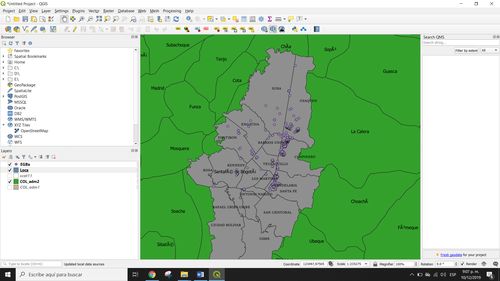
 
Una vez cargados los archivos será necesario conectarnos a la base de datos generada en la clase, las cual se obtiene mediante las siguientes configuraciones del servidor:
 

 
Al conectarnos al servidor creado en clase, será necesario vincular postgis en el programa QGIS, para ello, se seleccionará el icono de postgis donde se pedirá crear una nueva conexión, la cual debe llevar las siguientes configuraciones:

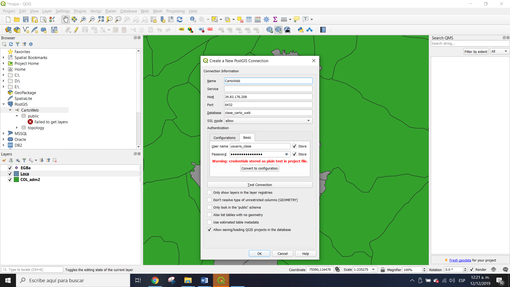
 
Luego de esto se tendrá que dirigir a la pestaña de base de datos donde se deben importar las 3 capas elegidas inicialmente

 
Una vez importadas las capas se podrán visualizar sus propiedades y atributos en la base de datos del Software PgAdmin, en el cual se realizara la consulta de geoprocesamiento.

 
Para este caso se desea visualizar la localidad de la ciudad de Bogotá con mayor cantidad de restaurantes y bares, por lo cual se realiza un conteo de este tipo de comercio por localidad y se selecciona la localidad con el mayor número:

 
El resultado es chapinero con 167 establecimientos como lo demuestra el resultado de la anterior consulta:

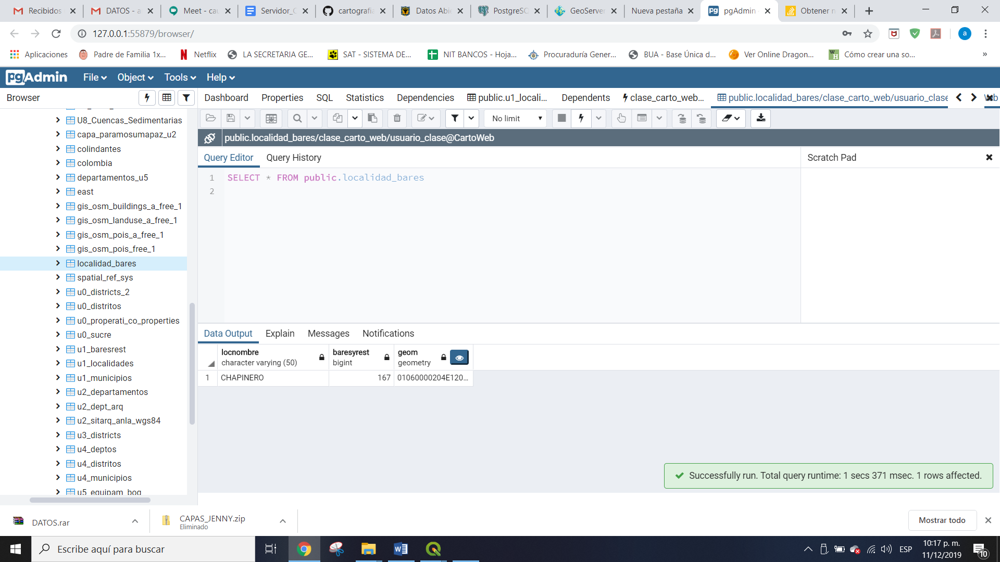
 
Una vez se ha realizado el geoprocesamiento se procede a ingresar las capas en GeoServer, para ello se debe dar clic sobre la pestaña capas y seleccionar agregar nuevo recurso

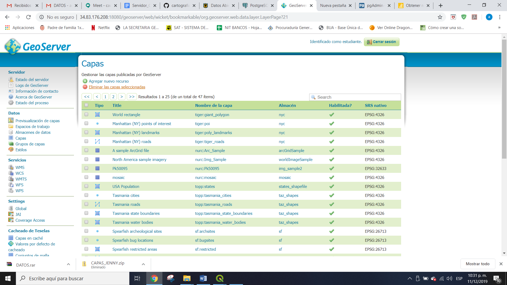

Una vez alli es necesario buscar las capas ingresadas a postgis  la capa generada mediante el geoprocesamiento, una vez encontradas se dara clic sobre la opción “publicacion”
 
 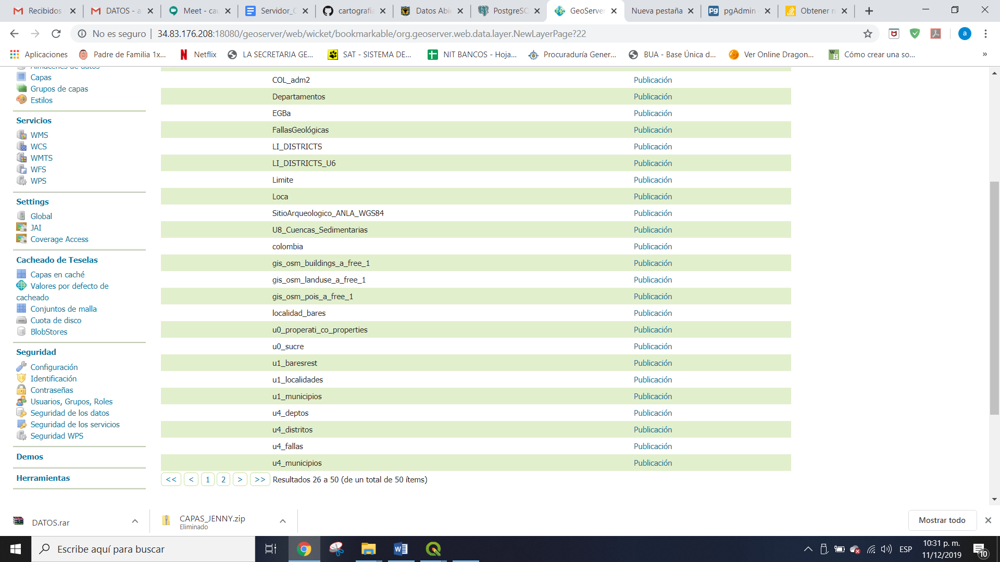
 
Allí será necesario llenar el encuadre como se muestra a continuación

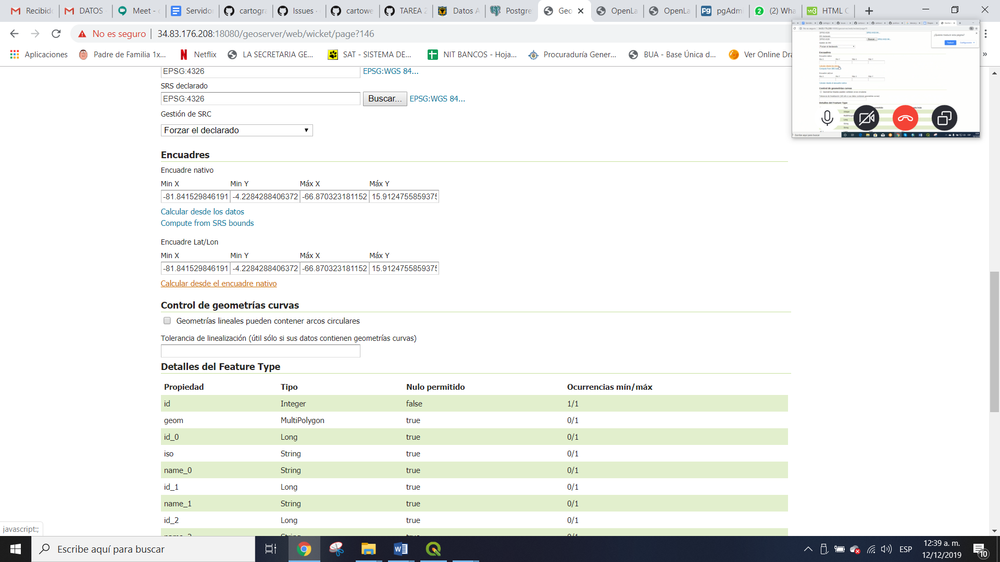
 
Finalmente se debe dar clic sobre la opción guardar para publicar en geoserver la capa seleccionada.

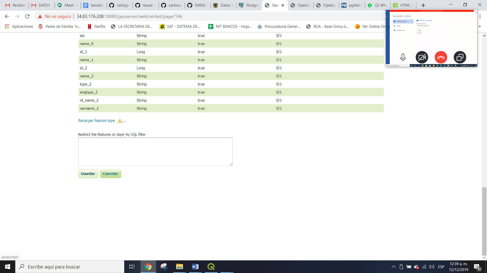
 
Este procedimiento es necesario realizarlo con las 4 capas requeridas. Para verificar que se han subido exitosamente, se puede dirigir a la ventana previsualizacion de capas donde se logra visualizar las capas subidas

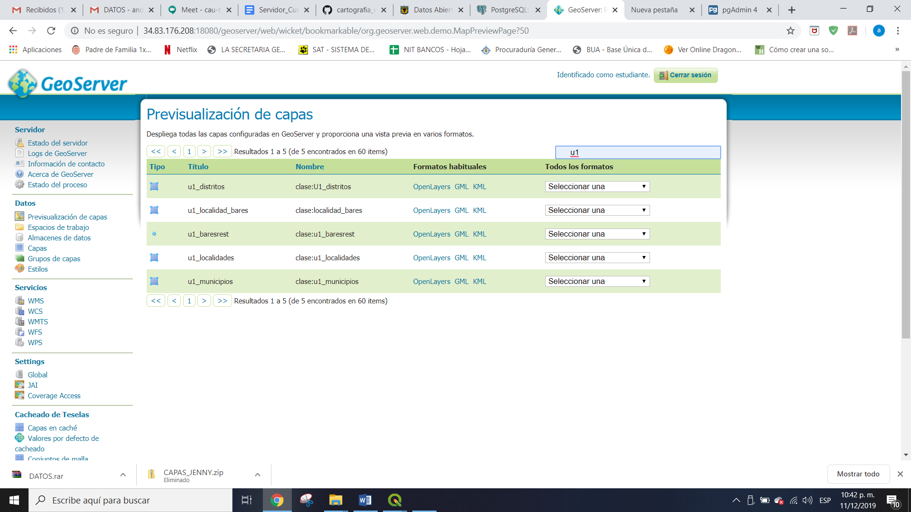
 
Luego de subir las capas a geoserver se procede a crear el grupo de capas dando clic sobre la opción gurpos de capas, alli se seleccionara agregar nuevo grupo de capas.

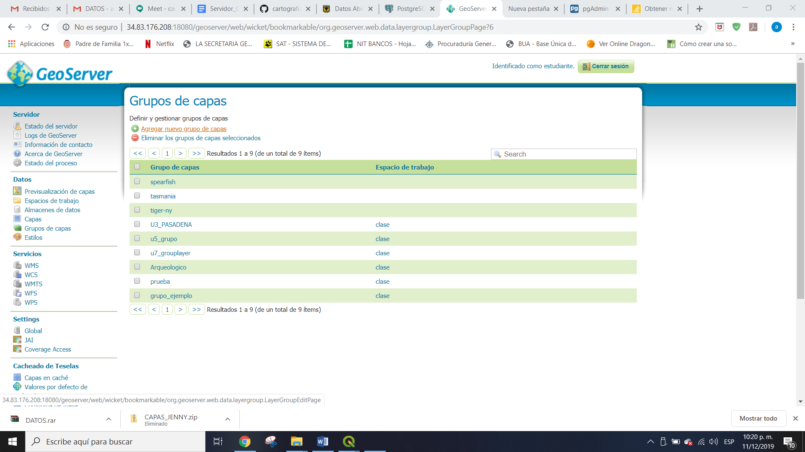
 
Una vez allí será necesario cargar las 4 capas obtenidas y generar los límites 

 
Luego de crear el grupo de capas se procede a asignar los estilos, para este caso se realizaron 2 estilos por formato SLD y 2 estilos por formato CSS. Para realizar el estilo por SLD será necesario generar mediante QGIS el estilo deseado y guardarlo con este formato.

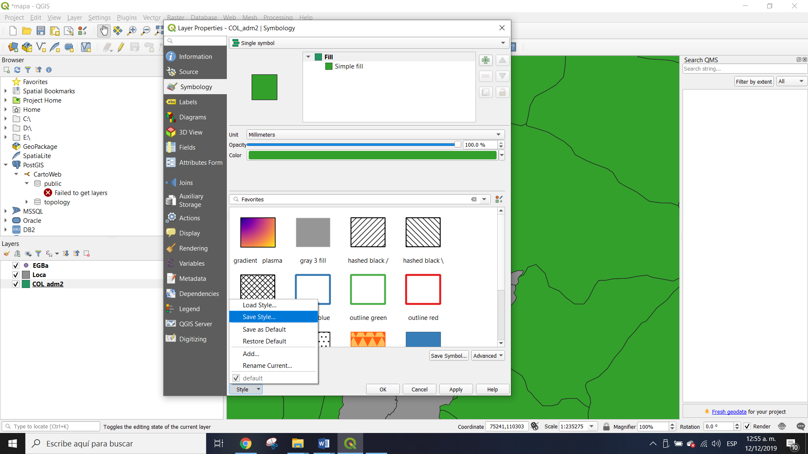
 
Luego de guardar el estilo generado en formato SLD se procede a crear un estilo en Geoserver, una vez alli se cargara el estilo generado en QGIS como se muestra a continuación:

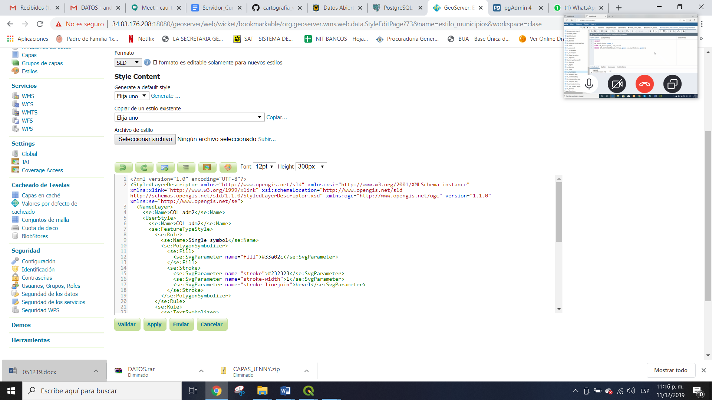
 
Una vez cargado el estilo en formato SLD es necesario validar y aplicar los datos cargados, luego de esto debemos a la pestaña publishing, donde es necesario buscar la capa a la cual le correspone el estilo creado donde se deben seleccionar los 2 recuadros, luego de esto será necesario validar y aplicar.

 
Ahora es necesario pasar a la pestaña layer preview donde es posible ver la pre visualización de la capa con el estilo generado. Luego de validar que toda la informacion este bien, se debe aplicar para guardar todos los cambios.

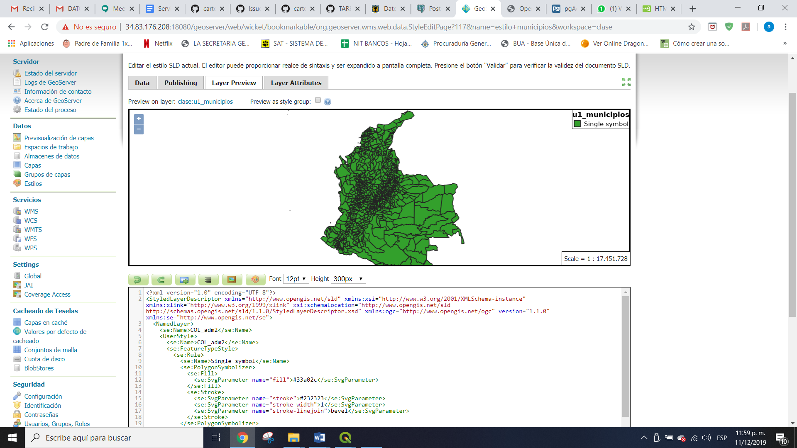
 
Este proceso se repitió para la capa localidades como se muestra a continuacion.

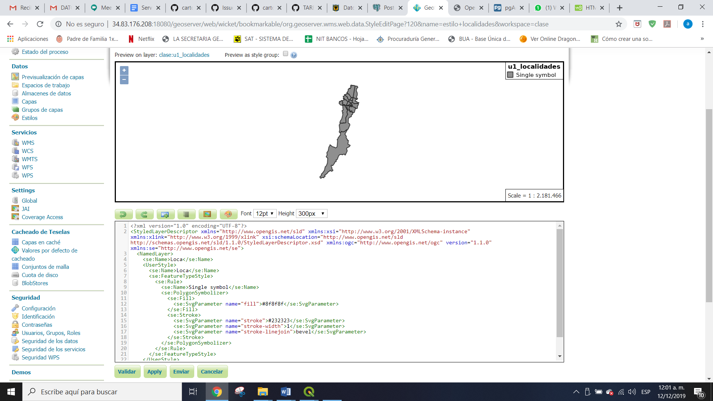
 
Este proceso se repitió para la capa con mayor restaurantes y bares, pero esta vez se realizó mediante el formato CSS el cual permite modificar a partir de código la representación del color en la capa como se muestra a continuacion:

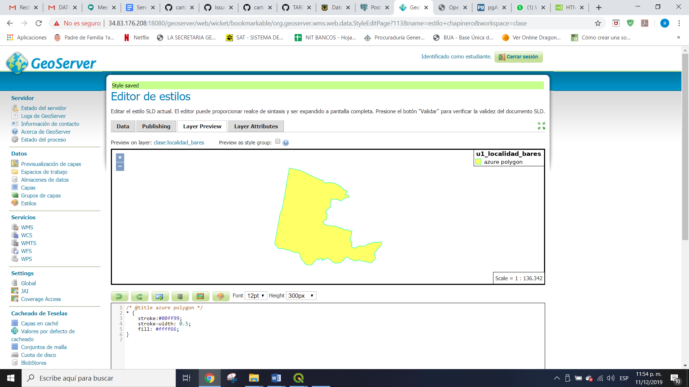
 
De igual manera el estilo de los puntos comercio de bares y restaurantes se realizó mediante el estilo CSS
 
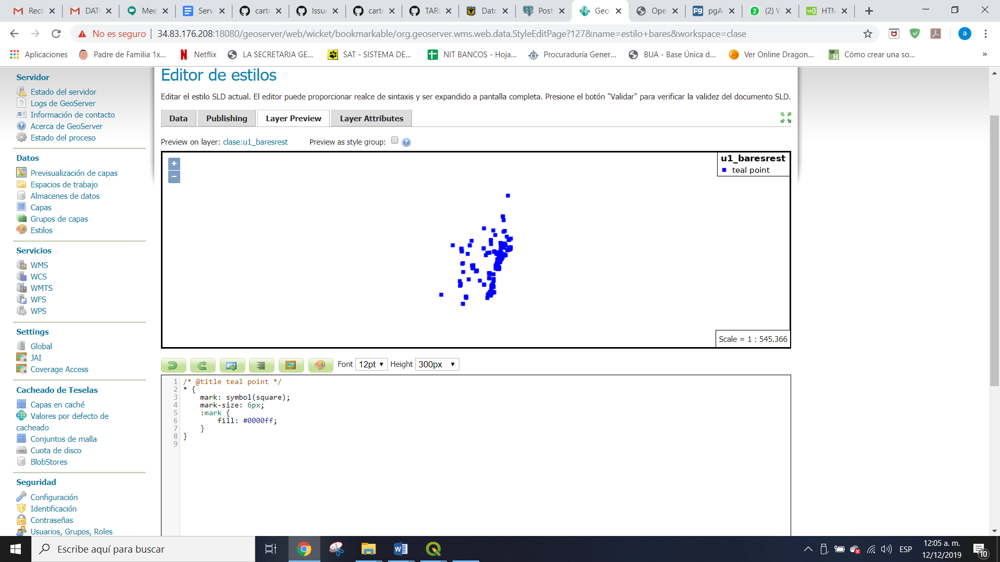

Finalmente en previsualizacion de capas, debemos buscar nuestro grupo de capas donde al abrir el layer se visualizara el mapa creado

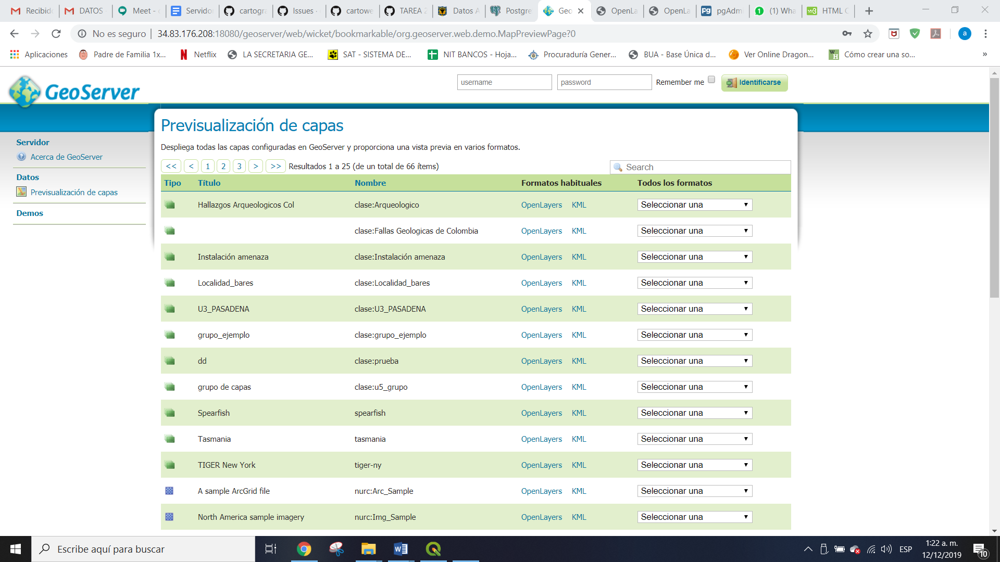
 
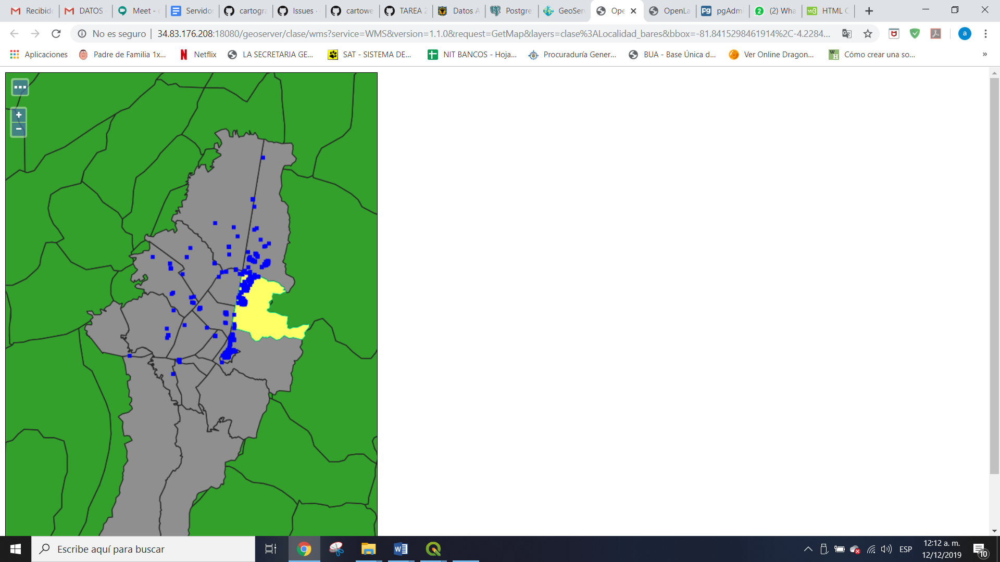

Link del mapa: http://34.83.176.208:18080/geoserver/clase/wms?service=WMS&version=1.1.0&request=GetMap&layers=clase%3ALocalidad_bares&bbox=-81.8415298461914%2C-4.22842884063721%2C-66.8703231811523%2C15.9124755859375&width=570&height=768&srs=EPSG%3A4686&format=application/openlayers
 
